# 안녕하세요.

LLM 협업 방법론을 직접 설계하고, 
AI를 활용해 실동작하는 서비스를 만드는 개발자입니다.

<!--  -->
<!--
## 🛠 Tech Stack

| Category | Technologies |
|---|---|
| **Backend** |     |
| **Frontend** |       |
| **AI / Data** |     |
| **Database** |    |
| **Infra** |   |
-->

---

### 💊 뭐냑 (AMApill) — MSA 기반 복약 관리 플랫폼

>         
 
부트캠프 3차 팀 프로젝트 (3인) | 2025.11 ~ 2025.12 | Backend 설계 · AI 연동 · Frontend 성능 최적화 담당
 
 

#### 주요 성과
 
| 항목 | Before | After | 개선 |
|------|--------|-------|------|
| 반복 조회 쿼리 수 | 197건 | 3건 | **98.5%↓** |
| 대시보드 초기 로딩 | 2.5초 | 1.5초 | **40%↓** |
| 약물 검색 재조회 | 외부 API/AI 재호출 | Redis cache hit | **동일 약물명 재검색 시 Redis cache hit으로 즉시 응답** |
 
 
 
#### 담당 구현
 
**Backend**
  
- **N+1 개선** — 복약 로그 조회 API 루프 내 `findById()` 단건 호출을 MyBatis IN절 + Map 일괄 조회로 재설계. 90건 기준 쿼리 197개 → 3개 (98.5%↓), 응답 3~5초 → 0.5초 이하 (Issue #112)
- **알림 Fail-Safe** — 알림 정책 오류 시 `shouldSend` 예외를 false로 처리(Block-by-default), DB 스키마 변경 없이 Redis State Overlay로 우회. 오발송·누락 양방향 해결, 감시 주기 30분 → 30초 외부화

**AI**

- **MFDS Fallback** — MFDS API 장애/타임아웃 시 Spring AI + OpenAI 기반 약물 검색 자동 전환. MFDS 결과 Redis 캐싱(TTL 24h), AI 생성 결과 별도 캐싱(TTL 7일)으로 동일 약물명 재검색 시 외부 호출 제거
- **AI 가드레일 (L1~L8)** — 프롬프트 인젝션 방어 및 API 비용 누수 방지를 위한 8계층 방어 아키텍처 직접 설계

 가드레일 계층 상세 보기

| Layer | 명칭 | 역할 |
|-------|------|------|
| L1 | Gateway Network | 네트워크 레벨 진입 차단 |
| L2 | Normalization | 공백·Zero-width·전각문자 정규화로 불가시 문자 기반 우회 인젝션 차단 (ICU4J) |
| L3 | Regex Guard | 표준 jailbreak 패턴(ignore/override/act-as 계열) Regex 탐지 및 스트라이크 누적 |
| L4 | Prompt Isolation | XML 태그 기반 입력 격리로 인젝션 차단 |
| L5 | AI Nano | GPT-4o-nano로 약물/질병 관련 여부 true/false 판별, 무관 요청 즉시 차단 |
| L6 | Core LLM | 검증 통과 요청만 메인 모델 실행 |
| L7 | Canary Token | 킬스위치 삽입으로 응답 유출 및 탈취 감지 |
| L8 | Resilience | abuse/bust 로그 기반 이상 트래픽 탐지 |
 
> 흐름: Gateway → Normalization → Regex → Prompt Isolation → AI 분류 → Core LLM → Canary → Resilience
 

 

**Frontend**
 
- **대시보드 최적화** — `zustand/shallow` + `React.memo` + 스토어 캐싱으로 불필요한 리렌더링 제거. Playwright 측정 기준 초기 로딩 40%↓ (2.5초 → 1.5초), 탭 전환 Zero-Latency
 

**기타**
 
- **PDF 리포트** — 지병/복약 목록 + 최근 30일 순응도(파이 차트) PDF 생성, OpenPDF 한글 폰트 임베딩

 
👉 [GitHub Organization](https://github.com/KOSA2025-FINAL-PROJECT-TEAM3)

---

### 🔍 Documind — AI 기반 문서 분석 RAG 시스템
>     

POC 프로젝트 (3인) | 2026.01

- 가중치 기반 하이브리드 검색(Embedding 0.6 + BM25 0.4)으로 검색 정확도 향상
- 벡터 스토어 장애 상황에 대비한 폴백(fallback) 경로 구축으로 서비스 연속성 확보
- 한글 UTF-8 BOM 및 PDF 출력 호환성 개선으로 문서 처리 안정성 강화
- SQLite 기반 메타데이터 관리 체계 도입으로 문서 추적성과 운영 효율 향상

👉 [GitHub](https://github.com/gmkoo-d3v/AIPOC)

---

### 🧭 ZeniManager — AI 기반 취업 지원 상담 관리 시스템
>       

팀 프로젝트 (5인) | 2026.03

**담당 역할 및 구현 내용**
- **대시보드 고도화**: 상담사별 KPI/통계, 캘린더, 메모(포스트잇) 기능을 설계·구현하고 대시보드 API 모듈을 분리해 업무 흐름과 유지보수성을 함께 개선.
- **유사 성공사례 검색**: 상담자 상세 페이지에서 `Supabase pgvector` 기반 취업 성공사례 유사검색 POC를 구현하고, 연령대/이름 마스킹 규칙을 적용해 개인정보 노출을 최소화.
- **보안/권한 강화**: 상담사 소유 boundary 기반 데이터 접근 제어를 적용하고, 상담사별 클라이언트 API 호출 보안을 강화.
- **인증 안정화**: Electron 환경에서 Supabase 세션 복구 흐름을 정비해 재로그인/유휴 상태 이후 인증 끊김 이슈를 완화.

> 💡 **한 줄 요약**
> ZeniManager에서 상담사 대시보드, 메모/캘린더, 유사 성공사례 벡터 검색, 권한 보안, Electron 세션 안정화를 중심으로 프론트엔드와 운영 품질을 고도화했습니다.

👉 [GitHub Repository](https://github.com/SuranS2/ZeniManager)

---
### 🧭 CodeGuide — 아키텍처·코드 품질 엔지니어링 스킬
 
개발 생산성/품질 표준화 스킬 | Skills

**구현 내용**
- **아키텍처 가이드 제공**: SOLID, DRY, KISS, YAGNI 기반으로 설계, 리팩터링, 리뷰, 디버깅 전반의 일관된 판단 기준을 제공합니다.
- **문서 중심 워크플로우 설계**: docs/task, plan, decisions, report, shadow, orchestration를 기준으로 작업 이력, 의사결정, 협업 상태를 체계화합니다.
- **멀티 에이전트 협업 체계 정립**: 메인 스레드는 supervising lead architect, 서브에이전트는 계획, 리뷰, 구현, 검증 역할로 분리해 협업 효율을 높입니다.
- **품질 검증 기준 강화**: 문서 검증, runtime validation, config-first, deterministic test 원칙을 통해 변경 안정성과 운영 신뢰도를 높입니다.

> 💡 **한 줄 요약**
> CodeGuide는 파일 기반 workspace docs를 system of record로 삼아, 세션 단위 컨텍스트 한계를 완화하고 의사결정 추적, 멀티 에이전트 협업, 검증 기준을 일관되게 운영하는 컨텍스트 엔지니어링 프레임워크입니다.

👉 [GitHub Repository](https://github.com/gmkoo-d3v/codeguide)

---

## 📊 GitHub Stats

  <picture>
    <source media="(prefers-color-scheme: dark)" srcset="https://github-readme-stats-private-sable.vercel.app/api?username=gmkoo-d3v&show_icons=true&theme=tokyonight" />
    
  </picture>

  <picture>
    <source media="(prefers-color-scheme: dark)" srcset="github-readme-stats-private-sable.vercel.app/api/top-langs/?username=gmkoo-d3v&layout=compact&theme=tokyonight" />
    
  </picture>

  <picture>
    <source media="(prefers-color-scheme: dark)" srcset="https://github-readme-streak-stats.herokuapp.com/?user=gmkoo-d3v&theme=tokyonight" />
    
  </picture>

## 🏆 GitHub Trophies
<picture>
  <source media="(prefers-color-scheme: dark)" srcset="./assets/trophy-dark.svg" />
  
</picture>

## 📈 Activity Graph

  <picture>
    <source media="(prefers-color-scheme: dark)" srcset="https://github-readme-activity-graph.vercel.app/graph?username=gmkoo-d3v&theme=tokyo-night&area=true" />
    
  </picture>

## 🐍 Contribution Snake

  <picture>
    <source media="(prefers-color-scheme: dark)" srcset="https://raw.githubusercontent.com/gmkoo-d3v/gmkoo-d3v/output/github-snake-dark.svg" />
    
  </picture>

## ✍️ Random Dev Quote

  <picture>
    <source media="(prefers-color-scheme: dark)" srcset="https://quotes-github-readme.vercel.app/api?type=vertical&theme=tokyonight" />
    
  </picture>

---

<!--### 블로그
👉 [GitHub](https://gmkoo-d3v.github.io/blog/) -->
